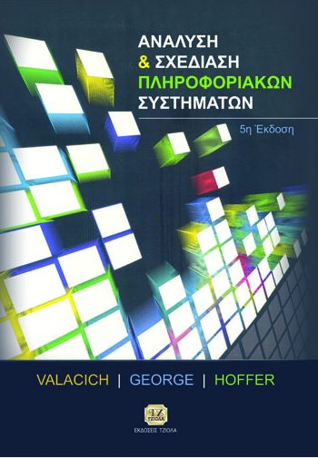

# Δημόσια Διοίκηση και Ηλεκτρονική Διακυβέρνηση

Σελίδα υποστήριξης της Θεματικής Ενότητας [ΔΜΔ54 - Πληροφοριακά Συστήματα και Ηλεκτρονική Διακυβέρνηση](https://www.eap.gr/education/postgraduate/biannual/dimosia-dioikisi-ilektroniki-diakyvernisi/topics-2/#dmd54) του Προγράμματος Μεταπτυχιακών Σπουδών [Δημόσια Διοίκηση και Ηλεκτρονική Διακυβέρνηση](https://www.eap.gr/education/postgraduate/biannual/dimosia-dioikisi-ilektroniki-diakyvernisi/) που διοργανώνει η [Σχολή Κοινωνικών Επιστημών του Ελληνικού Ανοικτού Πανεπιστημίου](https://www.eap.gr/education/ske/). Η κύρια σελίδα της Θεματικής Ενότητας ΔΜΔ54 είναι η <https://courses.eap.gr/course/view.php?id=1234>.

## ΔΜΔ54 - Πληροφοριακά Συστήματα Ηλεκτρονικής Διακυβέρνησης

### Βασικό σύγγραμμα ΔΜΔ54

* [Αρχείο excel (σχήμα 4.10, σελ. 115)](./resources/ΔΜΔ54.ΕΜ3.ΕΔ2%20ΑΝΑΛΥΣΗ%20ΚΟΣΤΟΥΣ%20(Σχήμα%204.10,%20σελ.%20115).xlsx)

### Προαιρετικό υλικό (εβδομάδες 1-4)

* COCOMO (Constructive Cost Modeling) BASIC
    * [Educative: What is the COCOMO model?](https://www.educative.io/answers/what-is-the-cocomo-model)
    * [BASIC COCOMO calculation](http://groups.umd.umich.edu/cis/course.des/cis525/js/f00/kutcher/kutcher.html)
    * [Mike's Basic COCOMO Calculator!](http://groups.umd.umich.edu/cis/course.des/cis525/js/f00/baker/cocomo.html)
    * [Πανεπιστήμιο Αιγαίου, Τεχνολογία Λογισμικού - εκτίμηση κόστους λογισμικού (Χαραλαμπίδης Ιωάννης)](https://eclass.aegean.gr/modules/document/file.php/ICSD121/Διδακτικό%20Πακέτο/Διαφάνειες%20Μαθήματος/SoftwareEngineering_13_SoftwareCostEstimation.pdf)
* Πρωτοτυποποίηση
    * [Figma for beginners (4 parts)](https://help.figma.com/hc/en-us/sections/4405269443991-Figma-for-Beginners-tutorial-4-parts-)
    * [Rapid Prototyping: Sketching & Paper Prototyping.](https://youtu.be/JMjozqJS44M)
* BPMN
    * [Business Process Model and Notation: An introductory guide](https://www.signavio.com/bpmn-introductory-guide/)

### Άλλα χρήσιμα αρχεία

* [Αρχείο excel για δραστηριότητα COCOMO της 2ης εβδομάδας μελέτης](./resources/ΔΜΔ54%20-%20ΕΒΔΟΜΑΔΑ%20ΜΕΛΕΤΗΣ%202%20(COCOMO).xlsx)
* [Αρχείο projectlibre (.pod) για τη δραστηριότητα χρονοπρογραμματισμού έργου της 2ης εβδομάδας μελέτης](./resources/ΔΜΔ54.ΕΜ2.ΕΔ3.pod)
* [Αρχείο excel για δραστηριότητα ανάλυσης κόστους της 3ης εβδομάδας μελέτης](./resources/ΔΜΔ54.ΕΜ3.ΕΔ2%20COST%20ANALYSIS.xlsx)
* [Βίντεο παρουσίασης του παραδείγματος εφαρμογής της Critical Path Method του βιβλίου](./resources/CPM.mp4)[^1]
* [Άσκηση κατασκευής ERD και σχεσιακού μοντέλου](./resources/Άσκηση%20ERD-Σχεσιακό%20μοντέλο.pdf)
    * [Βίντεο περιγραφής λύσης](./resources/Άσκηση%20ERD-Σχεσιακό%20μοντέλο.mp4)[^1]
* [Άσκηση κανονικοποίησης](./resources/Άσκηση%20κανονικοποίησης.pdf)
    * [Βίντεο περιγραφής λύσης](./resources/Άσκηση%20κανονικοποίησης.mp4)[^1]
* [Ασκήσεις 2ης ΟΣΣ](./resources/Ασκήσεις%202ης%20ΟΣΣ.xlsx)
* [Μετατροπή ERD σε σχεσιακό μοντέλο](./resources/Μετατροπή%20ERD%20σε%20Σχεσιακό%20μοντέλο.xlsx)

[^1]: Το βίντεο δημιουργήθηκε από το μέλος ΣΕΠ της ΔΜΔ54, Ηλία Γουνόπουλο.

## Διάφορα

### Λογισμικά
* [Project Libre](https://www.projectlibre.com/)
* [Ganttproject](https://www.ganttproject.biz/download)
* [Mermaid Live Editor](https://mermaid.live/) web application
* [Figma](https://www.figma.com/) web application
* [Lucid Chart](https://www.lucidchart.com/) web application
* [Draw.io ](https://github.com/jgraph/drawio-desktop/releases) 
    * [Draw.io](https://app.diagrams.net/) web application
* [Miro](https://miro.com/)
    * [Entity Relationship Diagram Template](https://miro.com/templates/entity-relationship-diagram/)
    * [How to draw an ER diagram](https://miro.com/diagramming/how-to-draw-an-er-diagram/)

### Bιβλία

* [Ταμπούρης, Ε., & Ταραμπάνης, Κ. (2024). Ηλεκτρονική Διακυβέρνηση. Κάλλιπος, Ανοικτές Ακαδημαϊκές Εκδόσεις.](https://repository.kallipos.gr/handle/11419/12132?&locale=el)

### Νομοθετικές πράξεις Ευρωπαϊκής Ένωσης (EU Acts)

* [EU Data Act](https://ec.europa.eu/commission/presscorner/detail/el/ip_23_3491)
* [EU AI Act](https://digital-strategy.ec.europa.eu/en/policies/regulatory-framework-ai)

### Podcasts

* [Απλά ψηφιακά](https://open.spotify.com/show/7JiW8DRsmqTR8ru5iUtNkS)
    * [Απλά Ψηφιακά 116: Ο Δ. Παπαστεργίου και τα επόμενα βήματα του υπουργείου Ψηφιακής Διακυβέρνησης](https://open.spotify.com/episode/4zx5H62qcppPb4McH7FP3p)
* [pod.gr - Do it Like Εσθονία: Ψηφιακή διακυβέρνηση](https://soundcloud.com/user-46820274-209698857/do-it-like-do-it-like-esthonia-psifiaki-diakivernisi)
* [The Digital Government podcast](https://ega.ee/digital-government-podcast/)
* [Transform Gov - the digital government podcast](https://shows.acast.com/transform-the-digital-government-podcast)

## Ενδιαφέροντες σύνδεσμοι

* [Μανιφέστο για την ευέλικτη ανάπτυξη λογισμικού](https://agilemanifesto.org/iso/el/manifesto.html)
* [ΔιαΝΕΟσις - Oι Ψηφιακές Ειδήσεις στην Ελλάδα το 2024](https://www.dianeosis.org/2024/06/oi-psifiakes-eidiseis-stin-ellada-2024/)
* [ΔιαΝΕΟσις - Η Ηλεκτρονική Διακυβέρνηση Στην Ελλάδα](https://www.dianeosis.org/research/egov_study/)
* [Innovation talks - Ηλεκτρονική Διακυβέρνηση](https://innovationtalks.gr/tag/ilektroniki-diakyvernisi/)